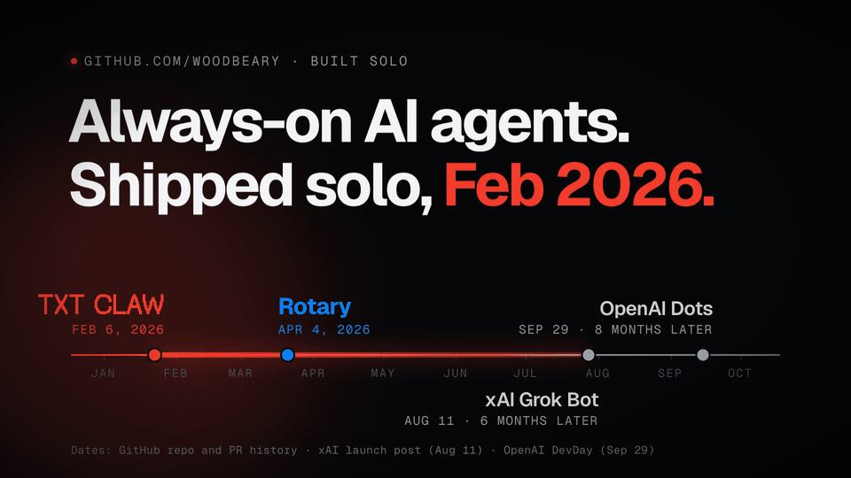

  

<h1 align="center">TXT CLAW → Rotary</h1>

  <b>I shipped always-on AI agents you can text in February 2026: six months before xAI's Grok Bot and eight months before OpenAI's Dots. Solo.</b> 
  Then I built the native iPhone app where those agents call and text for you. 
  <a href="https://jacob.com.ai">Jacob Lopez</a> · February to April 2026 · the real code and its original commit history are in this repo

  <a href="media/txtclaw-rotary-1080p.mp4"><b>Watch in 1080p</b></a> &nbsp;·&nbsp;
  <a href="#the-same-bet-earlier">Comparison</a> &nbsp;·&nbsp;
  <a href="#the-code">The code</a> &nbsp;·&nbsp;
  <a href="#architecture">Architecture</a> &nbsp;·&nbsp;
  <a href="EVIDENCE.md">Dated evidence</a> &nbsp;·&nbsp;
  <a href="https://jacob.com.ai">jacob.com.ai</a>

---

## The same bet, earlier

In February 2026 I bet that the next interface for AI is an agent that never sleeps, has a computer of its own, and lives where people already talk: their text messages. I built it alone, ran a real launch, and kept going. Six months later xAI launched Grok Bot. In September OpenAI launched Dots.

| | **TXT CLAW → Rotary** | **Grok Bot** (xAI) | **Dots** (OpenAI) |
|---|---|---|---|
| First shipped | **Feb 6, 2026** → Apr 4, 2026 | Aug 11, 2026 | Sep 29, 2026 |
| Always on, keeps working while you're away | Yes | Yes | Yes |
| A cloud computer of its own | A sandboxed container per user, on Cloudflare | One cloud computer your bots share | Its own cloud computer |
| How you reach it | Text it over SMS or iMessage; native iPhone app | Desktop and iOS apps | ChatGPT, Slack, Teams; SMS "coming soon" |
| Acts in the world | Browses, runs code, remembers; Rotary adds real phone lines, calls, and live call steering | Signs into your tools and finishes multi-step jobs | Connects to 4,000+ apps |
| Team | One person | xAI | OpenAI |

Sources: <a href="https://www.unite.ai/xai-launches-grok-bot-always-on-ai-teammates-with-their-own-cloud-computers/">Unite.AI on Grok Bot (Aug 11, 2026)</a> · <a href="https://techcrunch.com/2026/09/29/openai-launches-dots-its-bubbly-agentic-avatar/">TechCrunch on Dots (Sep 29, 2026)</a> · <a href="https://9to5google.com/2026/09/29/openai-dots-agent/">9to5Google on Dots (Sep 29, 2026)</a>. My dates are the commits in this repo; see <a href="EVIDENCE.md">EVIDENCE.md</a>.

## February 2026 · TXT CLAW

> **Your own AI. One text away.**

<table>
  <tr>
    <td width="33%"></td>
    <td width="33%"></td>
    <td width="33%"></td>
  </tr>
</table>
The real TXT CLAW site, captured on Feb 12, 2026. These files were committed that afternoon in <a href="https://github.com/woodbeary/rotary/commit/35c66b1">35c66b1</a>.

- **Every user gets an always-on agent with its own computer.** Each account maps to its own sandboxed Cloudflare container running an OpenClaw agent that browses, runs code, and keeps files, with an R2-backed workspace so memory survives restarts.
- **No app, no login. You text it.** SMS runs through a Twilio A2P 10DLC number, carrier registration included. iMessage runs through [OpenJimmy](https://github.com/woodbeary/openjimmy-public), a macOS bridge I wrote in January that reads the Messages database and replies through AppleScript.
- **A developer platform in three days (Feb 15 to 17).** A public `/v1` API with console keys, bring-your-own-key, rate limits, graded traces, warm-sandbox keepalive, hardened R2 persistence, an MCP surface, and end-to-end tests.
- **A real launch, run like a company.** A go-live run on Feb 11 covered 19 end-to-end scenarios and verified signed Twilio and Square webhooks ([report](txtclaw-web/docs/go-live-e2e-checklist-report-2026-02-11.md)). The controlled launch on Feb 18 was called GREEN ([report](txtclaw-web/docs/launch-execution-report-2026-02-18.md)). Carrier compliance, anti-abuse, and blast-radius policy are all [in the docs](txtclaw-web/docs).
- **One person, many agents.** Google Jules, Codex, and v0 worked in parallel on 20+ feature branches: 24 pull requests in five weeks.

## April 2026 · Rotary

> **Agents that call and text for you.**

  

The actual agent call workflow in the app: <a href="rotary-ios/Rotary/Sources/Features/Agents/AgentCallWorkflowScenario.swift"><code>AgentCallWorkflowScenario.swift</code></a>, first committed Apr 4, 2026 in <a href="https://github.com/woodbeary/rotary/commit/c5a0561">c5a0561</a>. Thirteen commits on Apr 4 and Apr 10 built the app.

- **A native SwiftUI app on real phone lines.** Agents, Messages, and Calls tabs. Twilio Voice with CallKit and PushKit, so an agent's call rings like any other call. Swift 6, iOS 26 Liquid Glass where available.
- **Agents that work the phone for you.** Ask for something ("get my lawn mowed tomorrow, under $95"). A planner agent scopes it, a caller agent dials providers and negotiates, and you get offers to compare. You can join a call to authorize one detail and drop off while the agent keeps going. The app ships this flow as a built-in demo run.
- **Steer it mid-call.** Steering and live-assist endpoints change what the assistant does during a real call. Every transcript line carries its latency.
- **Works offline.** Actions queue on the device ([`OfflineMutationQueue.swift`](rotary-ios/Rotary/Sources/Core/Offline/OfflineMutationQueue.swift)), and replies fall back to Apple's on-device Foundation Models ([`LocalInferenceEngine.swift`](rotary-ios/Rotary/Sources/Services/Offline/LocalInferenceEngine.swift)).
- **The backend.** A Next.js mobile API for agents, calls, live steering, phone-line provisioning, and voicemail, on Twilio, Supabase, and Clerk, with models from xAI, OpenAI, and Google through the Vercel AI SDK.

## The code

This repo holds the real source of both products with their original commit history, scrubbed of keys, a vendored SDK, and private business documents.

| Folder | What it is | History |
|---|---|---|
| [`txtclaw-web/`](txtclaw-web) | The TXT CLAW site, developer console, billing, API docs, and launch reports (Next.js, Clerk, Square, Twilio) | 35 commits, Feb 6 to Feb 28, 2026 |
| [`rotary-ios/`](rotary-ios) | The Rotary iPhone app (SwiftUI, Swift 6, CallKit, PushKit, Twilio Voice, Foundation Models) | 13 commits, Apr 4 to Apr 10, 2026 |
| [txtclaw-stack-public](https://github.com/woodbeary/txtclaw-stack-public) | The TXT CLAW runtime: Cloudflare Worker, per-user Sandbox containers, Durable Objects, R2 | Public mirror |

To build Rotary, add Twilio's `TwilioVoice.xcframework` 6.13.6 to `rotary-ios/Vendor/` (it isn't redistributed here) and open the project in Xcode 26. [`scripts/capture-rotary.sh`](scripts/capture-rotary.sh) builds it for the simulator and captures screens using the app's debug fixture mode.

## Architecture

<picture>
  <source media="(prefers-color-scheme: dark)" srcset="media/architecture-dark.svg">
  
</picture>

**What I built on:** [OpenClaw](https://github.com/openclaw/openclaw) (the agent itself) and Cloudflare's open-source [moltworker](https://github.com/cloudflare/moltworker) starter (Worker, Sandbox, and R2 wiring), plus Twilio, Clerk, Supabase, Square, and the Vercel AI SDK.

**What I built:** multi-tenant hosting with one sandboxed agent per user; the SMS and iMessage channels; the developer platform (API, keys, BYOK, rate limits, traces, MCP); the TXT CLAW site, console, billing, and launch; and Rotary, from the SwiftUI app and call workflow to the mobile API behind it.

## Timeline

| Date | What | Proof |
|---|---|---|
| Jan 30, 2026 | OpenJimmy: an iMessage channel for OpenClaw | [Public mirror](https://github.com/woodbeary/openjimmy-public) |
| Feb 6, 2026 | TXT CLAW site and product repo created | [414246d](https://github.com/woodbeary/rotary/commit/414246d) |
| Feb 9, 2026 | SMS notification workflow | [e44cc8a](https://github.com/woodbeary/rotary/commit/e44cc8a) |
| Feb 11, 2026 | Go-live end-to-end run: 19 scenarios, signed webhooks verified | [Report](txtclaw-web/docs/go-live-e2e-checklist-report-2026-02-11.md) |
| Feb 12, 2026 | Landing page and Apple beta, screenshots above | [35c66b1](https://github.com/woodbeary/rotary/commit/35c66b1) |
| Feb 16–17, 2026 | Developer API portal: self-serve keys, docs, billing, E2E | [307fac2](https://github.com/woodbeary/rotary/commit/307fac2), [f9cbb03](https://github.com/woodbeary/rotary/commit/f9cbb03) |
| Feb 18, 2026 | Controlled launch called GREEN | [Report](txtclaw-web/docs/launch-execution-report-2026-02-18.md) |
| Feb 28, 2026 | A2P 10DLC carrier compliance and blast-radius policy | [1759ef8](https://github.com/woodbeary/rotary/commit/1759ef8) |
| Apr 4, 2026 | Rotary native iPhone app: 11 commits in one day | [c5a0561](https://github.com/woodbeary/rotary/commit/c5a0561) to [2b6c02d](https://github.com/woodbeary/rotary/commit/2b6c02d) |
| Aug 11, 2026 | xAI launches Grok Bot | [Unite.AI](https://www.unite.ai/xai-launches-grok-bot-always-on-ai-teammates-with-their-own-cloud-computers/) |
| Sep 29, 2026 | OpenAI launches Dots at DevDay | [TechCrunch](https://techcrunch.com/2026/09/29/openai-launches-dots-its-bubbly-agentic-avatar/) |

## About me

I'm Jacob. I've been building since 2005, when I ran game servers and forums at age 8. I'm self-taught, I grew up in a Deaf family, and I sold mortgages before I wrote software full time. Since mid-2023 I've made 5,900+ commits across 137 repositories, many of them deployed for real businesses. I build with fleets of coding agents, and I like being close to the people who use what I ship.

[jacob.com.ai](https://jacob.com.ai) &nbsp;·&nbsp; jacob@lopez.com.ai &nbsp;·&nbsp; [LinkedIn](https://www.linkedin.com/in/imjacoblopez) &nbsp;·&nbsp; [X](https://x.com/imjacoblopez) &nbsp;·&nbsp; [GitHub](https://github.com/woodbeary)
