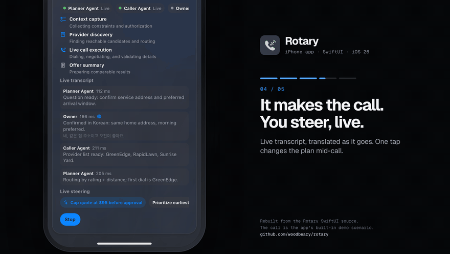
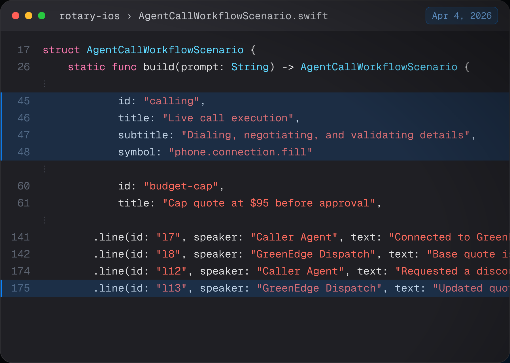
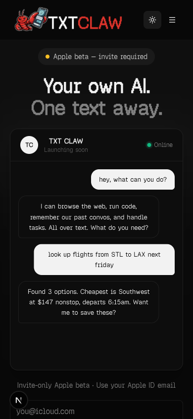
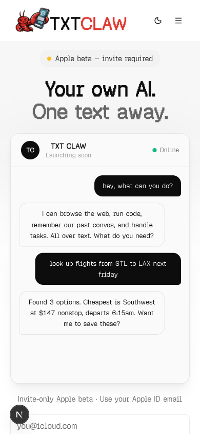
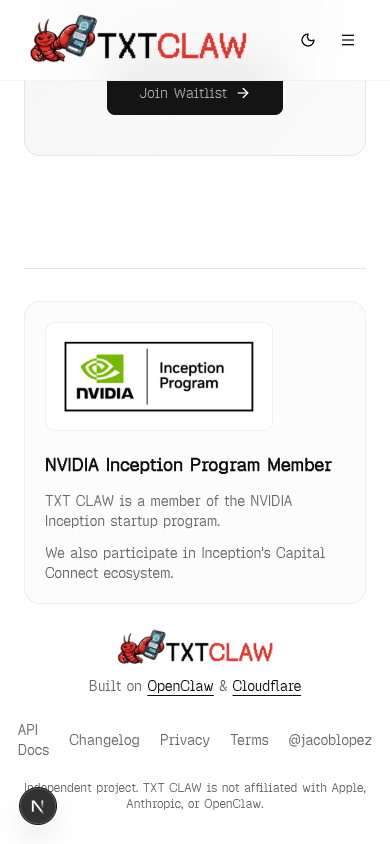
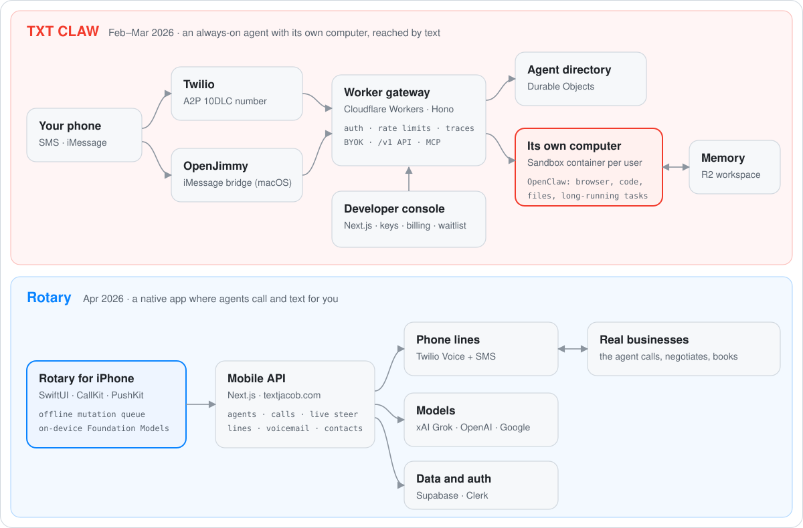

  

<h1 align="center">Rotary and TXT CLAW</h1>

  <b>AI agents you can text, and an iPhone app where your agent makes the phone call.</b> 
  Built solo by <a href="https://jacob.com.ai">Jacob Lopez</a>, February to April 2026. The real code and its original commit history are in this repo.

  <a href="media/rotary-make-a-call-1080p.mp4"><b>Watch the walkthrough in 1080p</b></a> &nbsp;·&nbsp;
  <a href="#rotary--the-iphone-app">Rotary</a> &nbsp;·&nbsp;
  <a href="#txt-claw--agents-you-text">TXT CLAW</a> &nbsp;·&nbsp;
  <a href="#architecture">Architecture</a> &nbsp;·&nbsp;
  <a href="EVIDENCE.md">Dated evidence</a> &nbsp;·&nbsp;
  <a href="https://jacob.com.ai">jacob.com.ai</a>

The walkthrough above is rebuilt frame by frame from the SwiftUI source in <a href="rotary-ios/Rotary/Sources"><code>rotary-ios/</code></a>: the colors come from <code>Theme.swift</code>, and the screens, copy, and call come from <code>Features/Agents</code>. The call it plays is the app's built-in demo scenario, <a href="rotary-ios/Rotary/Sources/Features/Agents/AgentCallWorkflowScenario.swift"><code>AgentCallWorkflowScenario.swift</code></a>.

---

## Rotary · the iPhone app

> **Your agent makes the call. You approve it first, and you can steer it while it talks.**

1. **Pick an agent.** Each agent can have its own phone number, voice, and instructions.
2. **Say what the call is for.** Switch the chat to *Make a Call* and type it in plain English.
3. **Approve before it dials.** Rotary shows the plan and the five things it will confirm (address, size, budget, timing, callback). Nothing is dialed until you tap Approve.
4. **Watch it work, and steer.** A planner agent scopes the job, a caller agent dials and negotiates, and every transcript line carries its speaker and latency. Lines in other languages arrive translated, with the original underneath. One tap adds a rule mid-call, like *cap the quote at $95*.
5. **Choose the result.** Offers come back ranked with price, time window, distance, and weather, and one tap picks one.

The app ships this flow as a built-in demo run, and that's what the walkthrough plays.

What's under it:

- **A native SwiftUI app on real phone lines.** Agents, Messages, and Calls tabs. Twilio Voice with CallKit and PushKit, so an agent's call rings like any other call. Swift 6, with iOS 26 Liquid Glass where available.
- **Steering that works on live calls.** Steering and live-assist endpoints change what the assistant does during a real call, and you can join a call to authorize one detail and drop off while the agent keeps going.
- **Works offline.** Actions queue on the device ([`OfflineMutationQueue.swift`](rotary-ios/Rotary/Sources/Core/Offline/OfflineMutationQueue.swift)), and replies fall back to Apple's on-device Foundation Models ([`LocalInferenceEngine.swift`](rotary-ios/Rotary/Sources/Services/Offline/LocalInferenceEngine.swift)).
- **The backend.** A Next.js mobile API for agents, calls, live steering, phone-line provisioning, and voicemail, on Twilio, Supabase, and Clerk, with models from xAI, OpenAI, and Google through the Vercel AI SDK.

  

The call workflow in the app, first committed Apr 4, 2026 in <a href="https://github.com/woodbeary/rotary/commit/c5a0561">c5a0561</a>. Thirteen commits on Apr 4 and Apr 10 built the app.

## TXT CLAW · agents you text

> **Your own AI. Its own computer. One text away.**

<table>
  <tr>
    <td width="33%"></td>
    <td width="33%"></td>
    <td width="33%"></td>
  </tr>
</table>
The live TXT CLAW site, captured on Feb 12, 2026 and committed that afternoon in <a href="https://github.com/woodbeary/rotary/commit/35c66b1">35c66b1</a>.

- **Every user gets an always-on agent with its own computer.** Each account maps to its own sandboxed Cloudflare container running an OpenClaw agent (on Claude) that browses, runs code, and keeps files, with an R2-backed workspace so memory survives restarts.
- **No app, no login. You text it.** SMS runs through a Twilio A2P 10DLC number, carrier registration included. iMessage runs through [OpenJimmy](https://github.com/woodbeary/openjimmy-public), a macOS bridge I wrote in January that reads the Messages database and replies through AppleScript.
- **A developer platform in three days (Feb 15 to 17).** A public `/v1` API with console keys, bring-your-own-key, rate limits, graded traces, warm-sandbox keepalive, hardened R2 persistence, an MCP surface, and end-to-end tests.
- **A real launch, run like a company.** A go-live run on Feb 11 covered 19 end-to-end scenarios and verified signed Twilio and Square webhooks ([report](txtclaw-web/docs/go-live-e2e-checklist-report-2026-02-11.md)). The controlled launch on Feb 18 was called GREEN ([report](txtclaw-web/docs/launch-execution-report-2026-02-18.md)). Carrier compliance, anti-abuse, and blast-radius policy are all [in the docs](txtclaw-web/docs). I launched it in person at xAI's office.
- **One person, many agents.** Google Jules, Codex, and v0 worked in parallel on 20+ feature branches: 24 pull requests in five weeks.

## The code

This repo holds the real source of both products with their original commit history, scrubbed of keys, a vendored SDK, and private business documents.

| Folder | What it is | History |
|---|---|---|
| [`rotary-ios/`](rotary-ios) | The Rotary iPhone app (SwiftUI, Swift 6, CallKit, PushKit, Twilio Voice, Foundation Models) | 13 commits, Apr 4 to Apr 10, 2026 |
| [`txtclaw-web/`](txtclaw-web) | The TXT CLAW site, developer console, billing, API docs, and launch reports (Next.js, Clerk, Square, Twilio) | 35 commits, Feb 6 to Feb 28, 2026 |
| [txtclaw-stack-public](https://github.com/woodbeary/txtclaw-stack-public) | The TXT CLAW runtime: Cloudflare Worker, per-user Sandbox containers, Durable Objects, R2 | Public mirror |

To build Rotary, add Twilio's `TwilioVoice.xcframework` 6.13.6 to `rotary-ios/Vendor/` (it isn't redistributed here) and open the project in Xcode 26. [`scripts/capture-rotary.sh`](scripts/capture-rotary.sh) builds it for the simulator and captures screens using the app's debug fixture mode.

## Architecture

<picture>
  <source media="(prefers-color-scheme: dark)" srcset="media/architecture-dark.svg">
  
</picture>

**What I built on:** [OpenClaw](https://github.com/openclaw/openclaw) (the agent itself) and Cloudflare's open-source [moltworker](https://github.com/cloudflare/moltworker) starter (Worker, Sandbox, and R2 wiring), plus Twilio, Clerk, Supabase, Square, and the Vercel AI SDK.

**What I built:** multi-tenant hosting with one sandboxed agent per user; the SMS and iMessage channels; the developer platform (API, keys, BYOK, rate limits, traces, MCP); the TXT CLAW site, console, billing, and launch; and Rotary, from the SwiftUI app and call workflow to the mobile API behind it.

## Timeline

| Date | What | Proof |
|---|---|---|
| Jan 30, 2026 | OpenJimmy: an iMessage channel for OpenClaw | [Public mirror](https://github.com/woodbeary/openjimmy-public) |
| Feb 6, 2026 | TXT CLAW site and product repo created | [414246d](https://github.com/woodbeary/rotary/commit/414246d) |
| Feb 9, 2026 | SMS notification workflow | [e44cc8a](https://github.com/woodbeary/rotary/commit/e44cc8a) |
| Feb 11, 2026 | Go-live end-to-end run: 19 scenarios, signed webhooks verified | [Report](txtclaw-web/docs/go-live-e2e-checklist-report-2026-02-11.md) |
| Feb 12, 2026 | Landing page and Apple beta, screenshots above | [35c66b1](https://github.com/woodbeary/rotary/commit/35c66b1) |
| Feb 16–17, 2026 | Developer API portal: self-serve keys, docs, billing, E2E | [307fac2](https://github.com/woodbeary/rotary/commit/307fac2), [f9cbb03](https://github.com/woodbeary/rotary/commit/f9cbb03) |
| Feb 18, 2026 | Controlled launch called GREEN | [Report](txtclaw-web/docs/launch-execution-report-2026-02-18.md) |
| Feb 28, 2026 | A2P 10DLC carrier compliance and blast-radius policy | [1759ef8](https://github.com/woodbeary/rotary/commit/1759ef8) |
| Apr 4, 2026 | Rotary native iPhone app: 11 commits in one day | [c5a0561](https://github.com/woodbeary/rotary/commit/c5a0561) to [2b6c02d](https://github.com/woodbeary/rotary/commit/2b6c02d) |
| Apr 10, 2026 | Rotary call workflow, steering, and offline updates | [0412685](https://github.com/woodbeary/rotary/commit/0412685) |

## About me

I'm Jacob. I've been building since 2005, when I ran game servers and forums at age 8. I'm self-taught, I grew up in a Deaf family, and I sold mortgages before I wrote software full time. As of October 2026 I've made 3,650 GitHub contributions in a year (1,024 in September alone), and more than 5,900 commits across 137 repositories since mid-2023, many deployed for real businesses. I build with fleets of coding agents, and I like being close to the people who use what I ship.

[jacob.com.ai](https://jacob.com.ai) &nbsp;·&nbsp; jacob@lopez.com.ai &nbsp;·&nbsp; [LinkedIn](https://www.linkedin.com/in/imjacoblopez) &nbsp;·&nbsp; [X](https://x.com/imjacoblopez) &nbsp;·&nbsp; [GitHub](https://github.com/woodbeary)
